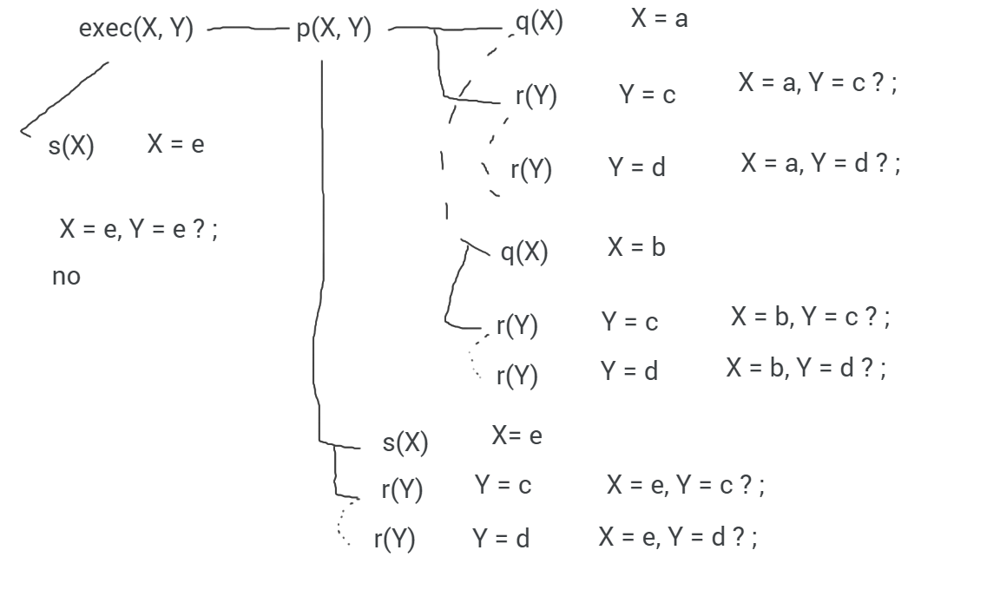

**1.**

b) Track:

```
    r(a,b)
    s(b,c)
    not(r(b,a))
    back to second

    s(b,d)
    not(r(b,a))
    back to second

    back to first

    r(a,c)
    s(c,c)
    not(r(c,a))
    not(s(c,c))

    back to second

    back to first

    r(b,a)
    back to first

    r(a,d)
    s(d,e)
    not(r(d,a))
    not(r(d,d))

    X=a, Y=d, Z=e?
```

Retrocede-se do 3º para o 2º objetivo 3 vezes.

----

**2.**

```
a(X,2). => yes

b(X, kalamazoo). => X=2?

c(X,b3). => X=a3?

c(X,Y). => X=a1, Y=b1?

d(X,Y). => X=a1,Y=2?
```

----

**3.** 

----

**4.**

a)

```pl
factorial(0,1).
factorial(N,valor):-
    N > 0,
    N1 is N - 1,
    factorial(N1,V1),
    Valor is N * V1.
```

b)

```pl
fibonacci(0,1).
fibonacci(1,1).
fibonacci(N,F):-
    N > 1
    N1 is N - 1,
    fibonacci(N1,F1),
    N2 is N - 2,
    fibonacci(N2,F2),
    F is F1 + F2.
```
